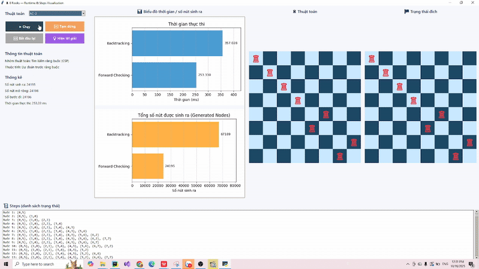

GIẢNG VIÊN HƯỚNG DẪN: Phan Thị Huyền Trang  
SINH VIÊN THỰC HIỆN: Võ Thị Mai Quỳnh  
Trường: Đại học Sư phạm Kỹ thuật TP.HCM
# Đề tài: GIẢI BÀI TOÁN 8 QUÂN XE BẰNG CÁC THUẬT TOÁN TÌM KIẾM 
Dự án này triển khai các thuật toán tìm kiếm khác nhau để giải bài toán **8 quân xe**.  
Mỗi thuật toán khám phá không gian trạng thái theo cách khác nhau, giúp minh họa ưu nhược điểm của từng chiến lược tìm kiếm.

---

## Mục lục

- [Mô tả bài toán](#mô-tả-bài-toán)
- [Cài đặt & chạy thử](#cài-đặt--chạy-thử)
- [Các thuật toán đã triển khai](#các-thuật-toán-đã-triển-khai)
  - [1. Tìm kiếm không có thông tin (Uninformed Search)](#1-tìm-kiếm-không-có-thông-tin-uninformed-search)
  - [2. Tìm kiếm có thông tin / heuristic (Informed Search)](#2-tìm-kiếm-có-thông-tin--heuristic-informed-search)
  - [3. Tìm kiếm cục bộ (Local Search)](#3-tìm-kiếm-cục-bộ-local-search)
  - [4. Không gian niềm tin / quan sát một phần (Belief-State / PO)](#4-không-gian-niềm-tin--quan-sát-một-phần-belief-state--po)
  - [5. Tìm kiếm trong bài toán ràng buộc (CSP Search)](#5-tìm-kiếm-trong-bài-toán-ràng-buộc-csp-search)
- [Thống kê & đánh giá](#thống-kê--đánh-giá)
- [Cấu trúc dự án](#cấu-trúc-dự-án)
---

## Mô tả bài toán

**Bài toán 8 quân xe (8 Rooks Problem):**  
Đặt 8 quân xe trên bàn cờ 8×8, mỗi hàng đúng 1 quân, sao cho **không quân nào trùng cột và khớp trạng thai đích**.  
Trạng thái đích thường biểu diễn bằng mảng 8 cột `[c0, c1, ..., c7]`.
---

## Cài đặt & chạy thử

### Yêu cầu
- Python 3.10+
- Tkinter (thường cài sẵn, nếu chưa có: `pip install tk`)

### Chạy chương trình
```bash
python app.py
```

---

## Các thuật toán đã triển khai

### 1. Tìm kiếm không có thông tin (Uninformed Search)

| Thuật toán | Mô tả | GIF minh họa            |
|------------|-------|-------------------------|
| **BFS** | Breadth-First Search – duyệt theo tầng |  |
| **DFS** | Depth-First Search – duyệt sâu trước |  |
| **DLS** | Depth-Limited Search – DFS giới hạn độ sâu |  |
| **IDS** | Iterative Deepening Search – lặp tăng độ sâu |  |
| **UCS** | Uniform Cost Search – mở rộng node chi phí nhỏ nhất |  |

---

### 2. Tìm kiếm có thông tin / heuristic (Informed Search)

| Thuật toán | Mô tả | GIF minh họa                  |
|-----------|-------|-------------------------------|
| **Greedy Best-First Search** | Chọn node có heuristic h nhỏ nhất |  |
| **A*** | Kết hợp g + h để tìm lời giải tối ưu |       |

---

### 3. Tìm kiếm cục bộ (Local Search)

| Thuật toán | Mô tả | GIF minh họa              |
|------------|-------|---------------------------|
| **Hill-Climbing** | Leo đồi, chọn trạng thái tốt hơn |      |
| **Simulated Annealing** | Cho phép lùi có kiểm soát để thoát kẹt |      |
| **Genetic Algorithm** | Thuật toán di truyền – tiến hóa quần thể |     |
| **Beam Search** | Giữ k ứng viên tốt nhất mỗi lớp |  |

---

### 4. Không gian niềm tin / quan sát một phần (Belief-State / PO)

| Thuật toán | Mô tả | GIF minh họa                       |
|------------|-------|------------------------------------|
| **AND–OR Search** | Tìm kiếm trong không gian quyết định & bất định |        |
| **Belief-State Search** | Tìm kiếm với trạng thái là tập niềm tin |       |
| **Belief-State (PO)** | Phiên bản môi trường quan sát một phần |  |

---

### 5. Tìm kiếm trong bài toán ràng buộc (CSP Search)

| Thuật toán              | Mô tả | GIF minh họa               |
|-------------------------|-------|----------------------------|
| **Backtracking Search** | Thử – lùi khi gặp mâu thuẫn |     |
| **Forward Checking**    | Cắt miền trước, phát hiện bế tắc sớm |  |
| **AC-3**                |  Duy trì tính nhất quán cung (arc-consistency) cho ràng buộc nhị phân;|     |

---

## Thống kê & đánh giá

Mỗi thuật toán khi chạy sẽ hiển thị:
- `generated`: số nút sinh ra  
- `expanded`: số nút mở rộng  
- `steps_count`: số bước đi  
- `depth`: độ sâu lời giải  
- `runtime_ms`: thời gian chạy (ms)

---
| **Nhóm thuật toán**   | **Đánh giá**                                                                                                                                                                                                                                                                                                                                                                                                                                                                                                                                                                                                                                                                                                                                                                                                                                                                                                 |
|-----------------------|--------------------------------------------------------------------------------------------------------------------------------------------------------------------------------------------------------------------------------------------------------------------------------------------------------------------------------------------------------------------------------------------------------------------------------------------------------------------------------------------------------------------------------------------------------------------------------------------------------------------------------------------------------------------------------------------------------------------------------------------------------------------------------------------------------------------------------------------------------------------------------------------------------------|
|  | Dựa trên biểu đồ so sánh, có thể nhận thấy sự khác biệt rõ rệt giữa các thuật toán về thời gian thực thi và số lượng nút được sinh ra trong bài toán 8 quân xe. Hai thuật toán BFS (Breadth-First Search) và IDS (Iterative Deepening Search) đều đảm bảo tính đầy đủ và tối ưu của lời giải, nhưng phải đánh đổi bằng thời gian xử lý cao và số lượng nút sinh ra rất lớn (hơn 109 nghìn nút). Cụ thể, BFS hoàn thành sau khoảng 259 ms, còn IDS tốn đến 287 ms do phải lặp lại nhiều mức sâu. <br/>Ngược lại, các thuật toán DFS, DLS và UCS có thời gian thực thi cực thấp (chỉ khoảng 0.01 ms) và số nút sinh ra ít hơn rất nhiều. Trong đó, DFS và DLS cho tốc độ cao nhất nhờ duyệt sâu và sử dụng ít bộ nhớ, nhưng không đảm bảo tìm được lời giải ngắn nhất. UCS hoạt động ổn định và hiệu quả hơn khi chi phí di chuyển giữa các trạng thái bằng nhau, giúp cân bằng giữa tốc độ và tính tối ưu.    |
|  | Biểu đồ cho thấy hai thuật toán Greedy Best-First Search và A* có hiệu năng gần như tương đương trong bài toán 8 quân xe. Cả hai đều hoàn thành quá trình tìm kiếm chỉ trong khoảng 1 ms, và số nút được sinh ra gần bằng nhau (≈ 64 nút). Cả hai thuật toán đều hiệu quả vượt trội so với nhóm tìm kiếm không có thông tin.Greedy Best-First Search dựa hoàn toàn vào hàm heuristic, nên có ưu thế về tốc độ do chỉ tập trung mở rộng các nút có ước lượng tốt nhất.Trong khi đó, A* kết hợp giữa chi phí thực tế (g) và ước lượng heuristic (h), nhờ đó vẫn duy trì độ tối ưu của lời giải trong khi hiệu năng gần tương đương Greedy.                                                                                                                                                                                                                                                                     |
|  | Thuật toán Hill-Climbing có tốc độ nhanh nhất (≈ 1 ms) và sinh ra ít nút nhất (≈ 194), do chỉ mở rộng nút có giá trị tốt hơn hiện tại. Tuy nhiên, nhược điểm lớn là dễ mắc kẹt tại cực trị địa phương(ở bài toán này không có), khiến kết quả không đảm bảo tối ưu toàn cục.<br/>   Simulated Annealing cải thiện hạn chế này bằng cách cho phép chấp nhận lời giải kém hơn trong giai đoạn đầu, nhờ đó có thể thoát khỏi cực trị địa phương. Thời gian thực thi chỉ khoảng 3 ms và số nút sinh ra ≈ 269, thể hiện sự cân bằng tốt giữa tốc độ và độ chính xác.<br/>Beam Search và Genetic Algorithm có thời gian lớn hơn (≈ 8–12 ms) và số nút sinh ra cao (≈ 1 500–1 737 nút), do phải duy trì nhiều trạng thái song song trong quần thể hoặc tập ứng viên. Dù tốn chi phí hơn, hai thuật toán này có khả năng khám phá toàn diện không gian nghiệm, giúp tăng xác suất tìm được lời giải tối ưu toàn cục. |
|  | Thuật toán AND–OR Search có thời gian thực thi lớn nhất (≈ 1.0 ms) nhưng lại sinh ra ít nút hơn (≈ 36 nút). Nguyên nhân là vì AND–OR Search phải xử lý cấu trúc cây gồm cả nút hội (AND) và nút chọn (OR), nhằm mô hình hóa các ràng buộc phụ thuộc giữa các hành động. Tuy tốn thời gian hơn, thuật toán này mang lại lời giải có tính khái quát và đầy đủ, đặc biệt phù hợp cho các bài toán phân rã mục tiêu hoặc có nhiều nhánh phụ thuộc logic.<br/>Ngược lại, hai biến thể Belief-State Search (đầy đủ và PO – Partially Observable) có thời gian thực thi nhanh hơn đáng kể (≈ 0.01 ms) nhưng lại sinh ra nhiều nút hơn (≈ 57–61 nút). Các thuật toán này hoạt động bằng cách duy trì tập hợp các trạng thái khả dĩ (tập niềm tin) và cập nhật chúng sau mỗi quan sát, giúp mô phỏng tốt các môi trường không xác định hoặc không quan sát đầy đủ.                                                    |
|  | Backtracking: chậm nhất (~357 ms) và sinh ra ~67.1k nút. Lý do là chỉ kiểm tra ràng buộc khi đã gán, nên phải thử–sai rất nhiều trước khi phát hiện xung đột “cùng cột”.<br/>Forward Checking (FC): cải thiện đáng kể (~253 ms, ~24.2k nút). FC xóa giá trị vi phạm khỏi miền các biến chưa gán ngay sau mỗi gán, giảm mạnh nhánh sai nhưng vẫn chỉ “nhìn trước 1 bước”, nên còn dư thử nghiệm.<br/>AC-3 (Arc Consistency): vượt trội (~5.0 ms, 26 nút). AC-3 lan truyền ràng buộc tất cả-khác nhau (các ràng buộc “colᵢ ≠ colⱼ”) trên toàn mạng trước khi/giữa các gán; với cấu trúc 8 Rooks (mỗi hàng một biến, miền là các cột), việc lan truyền nhanh chóng rút miền về các giá trị đơn (singleton) hoặc phát hiện vô nghiệm sớm, gần như không cần backtrack.                                                                                                                                                                                                                                                                                                                                                                                                                                                                                                                                |

## Cấu trúc dự án
```
A1/
├─ app.py              # GUI chính (Tkinter)
├─ algorithms/
│  ├─ __init__.py      # Đăng ký thuật toán (REGISTRY)
│  ├─ base.py
│  └─ ext/             # Các thuật toán cụ thể
│     ├─ bfs.py, dfs.py, dls.py, ids.py, ucs.py
│     ├─ greedy.py, astar.py
│     ├─ hill_climbing.py, simulated_annealing.py, genetic.py, beam_search.py
│     ├─ and_or.py, belief_state.py, belief_state_partially_observable.py
├─ utils/
│  └─ heuristics.py    # Định nghĩa heuristic, cost function
├─ assets/               # Chứa ảnh động minh họa
└─ README.md
```
